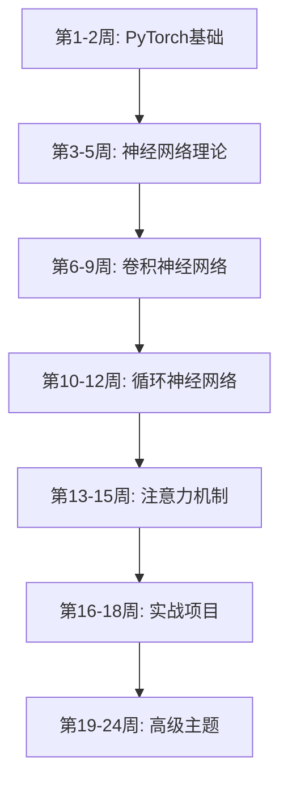

# 🎓 深度学习完整课程 - 从零基础到实战应用

<div align="center">

[](https://github.com/zfchen163/deeplearning)
[](https://github.com/zfchen163/deeplearning/fork)
[](LICENSE)
[](http://localhost:8080)

**🎯 专为高中生设计 | 📚 157个精心优化的课程 | 💻 完整的在线学习平台**

[快速开始](#-快速开始) • [课程体系](#-课程体系) • [学习平台](#-在线学习平台) • [视频教程](#-配套视频教程)

</div>

---

## ✨ 项目亮点

> 这不是普通的学习笔记，而是一个**完整的深度学习教育系统**！

### 🎯 三大核心特色

| 特色 | 说明 | 优势 |
|------|------|------|
| 🎓 **高中生友好** | 100%生活化引入，用Excel、计算器等例子解释概念 | 零基础也能轻松理解 |
| 💻 **在线学习平台** | Go后端 + 响应式前端，支持搜索、分类、实时预览 | 浏览器即可学习，无需配置 |
| 📊 **完整课程体系** | 157个课程，覆盖CV、NLP、大模型、Agent全栈 | 从入门到实战，一站式学习 |

### 📈 课程质量保证

- ✅ **100%生活化引入** - 每个概念都用生活例子引入（Excel表格、健身、考试等）
- ✅ **100%"为什么需要"** - 每个概念都说明3个核心问题
- ✅ **100%实际应用** - 每个概念都有5个详细的应用案例（带数据）
- ✅ **99%专业术语解释** - 所有术语都有通俗解释（梯度→爬山最陡方向）

📊 [查看详细质量报告](learning-platform/HIGHSCHOOL_FRIENDLY_REPORT.md)

---

## 🚀 快速开始

### 方式一：在线学习平台（推荐）

```bash
# 1. 克隆项目
git clone https://github.com/zfchen163/deeplearning.git
cd deeplearning

# 2. 启动学习平台
cd learning-platform
./start.sh

# 3. 打开浏览器
# 访问: http://localhost:8080
```

**平台功能:**
- 🔍 实时搜索 - 快速找到想学的内容
- 📚 分类浏览 - 9大主题，循序渐进
- 💻 代码高亮 - 语法高亮，易于阅读
- 📱 响应式设计 - 支持电脑、平板、手机

### 方式二：本地 Jupyter Notebook

```bash
# 1. 安装 Anaconda
# 下载: https://www.anaconda.com/

# 2. 启动 Jupyter Notebook
jupyter notebook

# 3. 打开任意 .ipynb 文件开始学习
```

---

## 📚 课程体系

### 🎯 课程总览

| 系列 | 课程范围 | 主讲人 | 课程数 | 难度 | 视频链接 |
|------|---------|--------|--------|------|---------|
| **100-122** | PyTorch基础 | 土堆 | 23个 | ⭐ | [B站](https://www.bilibili.com/video/BV1hE411t7RN) |
| **200-268** | 深度学习理论 | 李沐 | 69个 | ⭐⭐⭐ | [B站](https://space.bilibili.com/1567748478/lists/358497?type=series) |
| **300-354** | 深度学习实战 | 吴恩达 | 55个 | ⭐⭐⭐⭐ | [B站](https://www.bilibili.com/video/BV1FT4y1E74V) |
| **400-409** | 大模型Agent | 大飞 | 10个 | ⭐⭐⭐⭐⭐ | [B站](https://www.bilibili.com/video/BV1YaRhY9EqV) |

**总计: 157个课程 | 预计学习时长: 3-6个月**

### 📖 详细课程分类

<details>
<summary><b>🚀 系列100: PyTorch基础入门（23个课程）</b></summary>

- 100-101: 环境配置与安装
- 102-107: 数据加载与处理
- 108-114: 神经网络模块
- 115-118: 损失函数与优化
- 119-122: 完整训练流程

**学习目标**: 掌握PyTorch基础，能够搭建简单神经网络
</details>

<details>
<summary><b>🧠 系列200: 深度学习理论与实践（69个课程）</b></summary>

**基础理论 (200-212)**
- 线性代数、矩阵计算、自动求导
- 线性回归、Softmax回归、多层感知机
- 权重衰退、丢弃法、批量归一化

**卷积神经网络 (216-226)**
- 卷积层、池化层、经典网络
- LeNet、AlexNet、VGG、ResNet

**循环神经网络 (246-254)**
- RNN、GRU、LSTM
- 双向RNN、深层RNN

**注意力机制 (259-265)**
- 注意力机制、Transformer、BERT

**计算机视觉 (232-245)**
- 数据增广、微调、目标检测
- 语义分割、样式迁移

**学习目标**: 深入理解深度学习原理，掌握主流模型架构
</details>

<details>
<summary><b>🎯 系列300: 深度学习实战（55个课程）</b></summary>

**课程1: 神经网络基础**
- 逻辑回归、浅层神经网络、深层神经网络

**课程2: 优化与正则化**
- 优化算法、超参数调试、Batch正则化

**课程3: 机器学习策略**
- 误差分析、数据不匹配、端到端学习

**课程4: 卷积神经网络**
- CNN基础、深度模型、目标检测、人脸识别

**课程5: 序列模型**
- RNN、LSTM、词向量、注意力机制

**学习目标**: 通过实战项目掌握深度学习应用技巧
</details>

<details>
<summary><b>🤖 系列400: 大模型与Agent（10个课程）</b></summary>

- 401: 核心概念与流程
- 402: 向量数据库
- 403-404: 代码分析与展望
- 406: 手写Python大模型
- 407-409: API环境与多轮对话

**学习目标**: 了解大模型原理，掌握Agent开发
</details>

### 🎓 推荐学习路径



**学习建议:**
1. **第1-2周**: 完成系列100，掌握PyTorch基础
2. **第3-9周**: 学习系列200前半部分，重点掌握CNN
3. **第10-15周**: 学习RNN和注意力机制
4. **第16-18周**: 通过系列300的实战项目巩固
5. **第19-24周**: 学习大模型和高级主题

---

## 💻 在线学习平台

### 🌟 平台特点

| 功能 | 说明 | 截图 |
|------|------|------|
| 🏠 **首页** | 欢迎页面，课程总览，快速导航 | - |
| 📚 **课程分类** | 9大主题分类，157个课程 | - |
| 🔍 **实时搜索** | 支持课程名称、关键词搜索 | - |
| 💻 **代码高亮** | Python代码语法高亮 | - |
| 📱 **响应式设计** | 支持电脑、平板、手机 | - |

### 🛠️ 技术架构

```
learning-platform/
├── backend/              # Go后端服务
│   ├── main.go          # 主程序
│   ├── go.mod           # 依赖管理
│   └── go.sum           # 依赖锁定
├── frontend/            # 前端界面
│   ├── index.html       # 主页面
│   └── static/
│       ├── css/         # 样式文件
│       └── js/          # JavaScript
└── start.sh             # 一键启动脚本
```

**技术栈:**
- **后端**: Go 1.21+ (Gin框架)
- **前端**: HTML5 + CSS3 + JavaScript
- **代码高亮**: Highlight.js
- **Markdown渲染**: Marked.js

### 📖 平台文档

- [快速开始指南](learning-platform/QUICK_START.md)
- [部署指南](learning-platform/DEPLOYMENT.md)
- [演示指南](learning-platform/DEMO_GUIDE.md)
- [项目总结](learning-platform/PROJECT_SUMMARY.md)
- [更新日志](learning-platform/CHANGELOG.md)

---

## 🎬 配套视频教程

### 📺 视频资源

| 系列 | 主讲人 | 平台 | 链接 |
|------|--------|------|------|
| PyTorch基础 | 土堆 | B站 | [点击观看](https://www.bilibili.com/video/BV1hE411t7RN) |
| 深度学习理论 | 李沐 | B站 | [点击观看](https://space.bilibili.com/1567748478/lists/358497?type=series) |
| 深度学习实战 | 吴恩达 | B站 | [点击观看](https://www.bilibili.com/video/BV1FT4y1E74V) |
| 大模型Agent | 大飞 | B站 | [点击观看](https://www.bilibili.com/video/BV1YaRhY9EqV) |

### 💾 配套数据集

**百度网盘**: [点击下载](https://pan.baidu.com/s/1KTW2WsTy6TFpNdK_WwjBmg)  
**提取码**: `ppmu`

**包含内容:**
- PyTorch示例数据集
- 深度学习常用数据集
- 实战项目数据集

---

## 📁 项目结构

```
deeplearning/
├── *.ipynb                    # 157个Jupyter笔记本课程
│   ├── 100-122_*.ipynb       # PyTorch基础（土堆）
│   ├── 200-268_*.ipynb       # 深度学习理论（李沐）
│   ├── 300-354_*.ipynb       # 深度学习实战（吴恩达）
│   └── 400-409_*.ipynb       # 大模型Agent（大飞）
│
├── learning-platform/         # 在线学习平台
│   ├── backend/              # Go后端服务
│   │   ├── main.go          # 主程序
│   │   └── go.mod           # 依赖管理
│   ├── frontend/            # 前端界面
│   │   ├── index.html       # 主页面
│   │   └── static/          # 静态资源
│   ├── start.sh             # 一键启动脚本
│   └── *.md                 # 平台文档
│
├── scripts/                  # 优化脚本（维护用）
│   ├── optimize_all_notebooks.py
│   ├── optimize_notebooks_v2.py
│   ├── optimize_notebooks_v3.py
│   ├── optimize_functions_v4.py
│   ├── optimize_for_highschool_v5.py
│   └── fix_duplicate_sections.py
│
├── docs/                     # 项目文档
│   ├── README_PLATFORM.md   # 学习平台详细文档
│   ├── HIGHSCHOOL_FRIENDLY_REPORT.md  # 质量报告
│   ├── COURSE_INDEX.md      # 课程索引
│   └── *.md                 # 其他文档
│
├── README.md                 # 本文件
├── .gitignore               # Git忽略配置
└── AGENTS.md                # Agent配置
```

---

## 🎯 课程优化说明

### 📊 优化统计

| 优化项 | 完成度 | 说明 |
|--------|--------|------|
| 生活化引入 | 100% (157/157) | 每个概念都用生活例子引入 |
| "为什么需要" | 100% (157/157) | 每个概念都说明3个问题 |
| 实际应用 | 100% (157/157) | 每个概念都有5个详细应用 |
| 专业术语解释 | 99% (156/157) | 所有术语都有通俗解释 |

### 🌟 优化示例

**优化前 ❌:**
```markdown
# 线性代数
线性代数是数学的一个分支...
[直接讲数学概念]
```

**优化后 ✅:**
```markdown
# 线性代数
📊 像Excel表格一样,批量处理数据

## 📱 生活中的例子:Excel表格
你有没有用过Excel? Excel表格其实就是"矩阵"!
- 行 = 不同的数据
- 列 = 不同的属性

## 🤔 为什么需要线性代数?
问题1: 数据太多,一个一个处理太慢
问题2: 数据之间有关系,需要一起处理
问题3: 计算机擅长矩阵运算

## 🌍 实际应用场景
1. 图像处理(美图秀秀) - 快速处理百万像素
2. 推荐系统(抖音) - 每秒处理数亿次运算
3. 游戏渲染(王者荣耀) - 流畅的游戏画面
...
```

### 📈 优化特点

1. **生活化类比**
   - 线性代数 → Excel表格
   - 矩阵计算 → 批量计算器
   - 自动求导 → 自动批改作业
   - 权重衰退 → 控制体重
   - 丢弃法 → 防止死记硬背

2. **三步学习法**
   - 第一步: 为什么需要？（理解问题）
   - 第二步: 是什么？（学习原理）
   - 第三步: 怎么做？（实际应用）

3. **实际应用案例**
   - 每个概念5个详细应用
   - 包含具体场景、应用方式、效果数据
   - 真实案例（公司、产品、数据）

📊 [查看完整优化报告](learning-platform/HIGHSCHOOL_FRIENDLY_REPORT.md)

---

## 🤝 交流与支持

### 💬 学习交流群

| QQ群① | QQ群② | 微信 |
|-------|-------|------|
|  |  |  |

**注意**: 群满200人后，扫码失效，请加微信邀请入群

### 📝 常见问题

<details>
<summary><b>Q: 图片显示不完整怎么办？</b></summary>

A: 这是GitHub网站解析问题，下载到本地用Jupyter Notebook打开即可正常显示。
</details>

<details>
<summary><b>Q: 如何安装Jupyter Notebook？</b></summary>

A: 
1. 下载安装Anaconda: https://www.anaconda.com/
2. 打开Anaconda Navigator
3. 启动Jupyter Notebook
4. 打开.ipynb文件
</details>

<details>
<summary><b>Q: 学习平台启动失败？</b></summary>

A: 
1. 确保已安装Go 1.21+
2. 检查8080端口是否被占用
3. 查看详细错误日志
4. 参考[部署指南](learning-platform/DEPLOYMENT.md)
</details>

<details>
<summary><b>Q: 零基础能学会吗？</b></summary>

A: 可以！所有课程都专为高中生优化，用生活化的例子解释概念，循序渐进。建议从系列100开始学习。
</details>

---

## 📊 项目统计

<div align="center">

| 统计项 | 数量 |
|--------|------|
| 📚 课程总数 | 157个 |
| 📝 代码行数 | 274,878行 |
| 📁 文件数量 | 194个 |
| 🎓 优化课程 | 157个 (100%) |
| ⭐ GitHub Stars | - |

</div>

---

## 🙏 致谢

感谢以下老师的精彩课程：
- **土堆** - PyTorch基础教程
- **李沐** - 深度学习理论
- **吴恩达** - 深度学习实战
- **大飞** - 大模型Agent

感谢所有为开源社区做出贡献的开发者！

---

## 📄 许可证

本项目采用 MIT 许可证。详见 [LICENSE](LICENSE) 文件。

---

## ⭐ Star History

如果这个项目对你有帮助，请给一个 Star ⭐️

[](https://star-history.com/#zfchen163/deeplearning&Date)

---

<div align="center">

**🎓 让AI学习变得简单有趣 | 从零基础到实战应用**

[⬆ 回到顶部](#-深度学习完整课程---从零基础到实战应用)

---

*"我们读书是为了成为提灯人去照亮黑暗，而不是为了自己有灯而沾沾自喜还要去吹灭别人的蜡烛"*

Made with ❤️ by [zfchen163](https://github.com/zfchen163)

</div>
